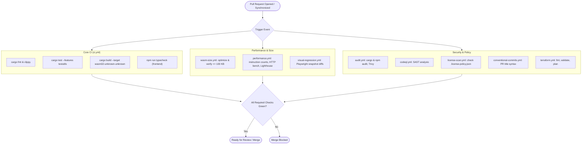
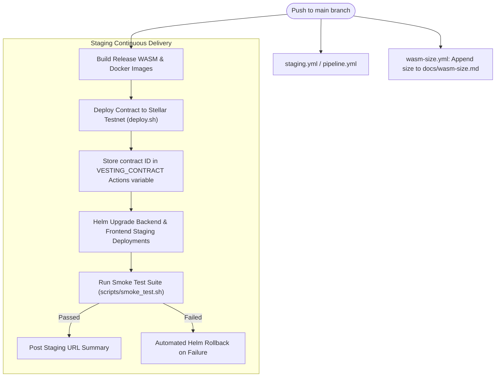
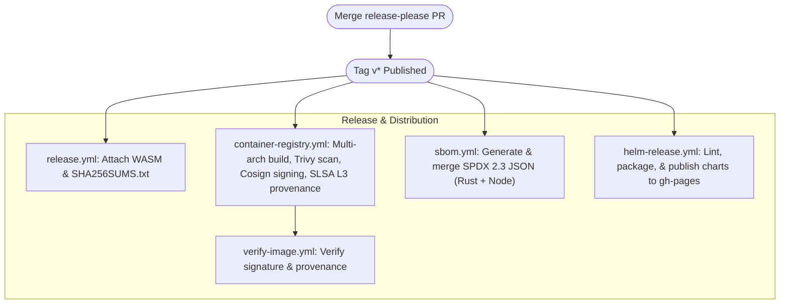
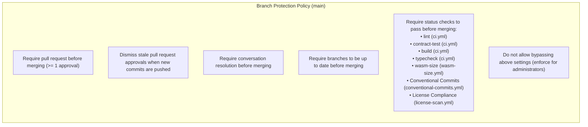

# CI/CD Pipeline Documentation

**Version:** 1.2.0  
**Status:** Active  
**Last Updated:** 2026-08-30  

This document provides a comprehensive reference for the CI/CD automation pipelines supporting the Vesting Cliff Drip Stream repository. It covers all 23 GitHub Actions workflows, visual architecture diagrams, required secrets and rotation schedules, quality gates, branch protection rules, local reproduction steps, and instructions for contributing new workflow steps.

---

## Table of Contents

1. [Pipeline Architecture Diagrams](#1-pipeline-architecture-diagrams)
   - 1.1 [Pull Request Quality Gate Flow](#11-pull-request-quality-gate-flow)
   - 1.2 [Main Branch & Staging Deployment Flow](#12-main-branch--staging-deployment-flow)
   - 1.3 [Release, Supply Chain & Publishing Flow](#13-release-supply-chain--publishing-flow)
2. [Workflow Catalog](#2-workflow-catalog)
   - 2.1 [Core Continuous Integration](#21-core-continuous-integration)
   - 2.2 [Performance & Size Enforcement](#22-performance--size-enforcement)
   - 2.3 [Security, Auditing & Compliance](#23-security-auditing--compliance)
   - 2.4 [Supply Chain Security & SBOM](#24-supply-chain-security--sbom)
   - 2.5 [Staging & Production Deployment](#25-staging--production-deployment)
   - 2.6 [Helm Chart Release & Infrastructure Operations](#26-helm-chart-release--infrastructure-operations)
3. [Deep Dives: Key New Workflows](#3-deep-dives-key-new-workflows)
   - 3.1 [Helm Release Workflow (`helm-release.yml`)](#31-helm-release-workflow-helm-releaseyml)
   - 3.2 [Consolidated SBOM Generation (`sbom.yml`)](#32-consolidated-sbom-generation-sbomyml)
   - 3.3 [Visual Regression Testing (`visual-regression.yml`)](#33-visual-regression-testing-visual-regressionyml)
   - 3.4 [Performance Gate & Benchmarks (`performance.yml`)](#34-performance-gate--benchmarks-performanceyml)
   - 3.5 [WASM Optimization & Size Guard (`wasm-size.yml`)](#35-wasm-optimization--size-guard-wasm-sizeyml)
4. [Quality Gates & Enforcement Matrix](#4-quality-gates--enforcement-matrix)
   - 4.1 [Required Status Checks (PR Blockers)](#41-required-status-checks-pr-blockers)
   - 4.2 [Advisory & Scheduled Checks](#42-advisory--scheduled-checks)
5. [Required GitHub Secrets & Rotation Policy](#5-required-github-secrets--rotation-policy)
6. [Branch Protection Rules](#6-branch-protection-rules)
7. [Running Checks Locally](#7-running-checks-locally)
8. [Debugging & Troubleshooting CI/CD Failures](#8-debugging--troubleshooting-cicd-failures)
9. [How to Add a New Workflow Step](#9-how-to-add-a-new-workflow-step)

---

## 1. Pipeline Architecture Diagrams

The CI/CD system operates across three distinct triggers: **Pull Requests**, **Main Branch Commits**, and **Release Publications**.

### 1.1 Pull Request Quality Gate Flow



### 1.2 Main Branch & Staging Deployment Flow



### 1.3 Release, Supply Chain & Publishing Flow



---

## 2. Workflow Catalog

All workflow definition files reside in [`.github/workflows/`](../.github/workflows/). Below is the complete catalog of all 23 workflows.

### 2.1 Core Continuous Integration

| File | Name | Triggers | Description |
|---|---|---|---|
| [`ci.yml`](../.github/workflows/ci.yml) | CI | Push (all branches), PR | Executes formatting check (`rustfmt`), static linter (`clippy -D warnings`), contract unit/integration test suite with `testutils`, WASM target compilation, documentation test, and frontend TypeScript type-checking. |
| [`reusable-rust-build.yml`](../.github/workflows/reusable-rust-build.yml) | Reusable Rust Build | `workflow_call` | Shared composite workflow providing standardized Rust toolchain installation, Cargo registry caching, and release WASM compilation for downstream workflows. |
| [`conventional-commits.yml`](../.github/workflows/conventional-commits.yml) | Conventional Commits | PR (`opened`, `edited`, `synchronize`, `reopened`) | Validates that pull request titles adhere to the Conventional Commits specification (e.g., `feat:`, `fix:`, `docs:`, `chore:`). |
| [`storybook.yml`](../.github/workflows/storybook.yml) | Storybook | Push to `main`, PR to `main` | Builds the frontend Storybook component library, executes component interaction tests, and publishes documentation to GitHub Pages. |
| [`e2e.yml`](../.github/workflows/e2e.yml) | End-to-End Tests | Push to `main`, PR to `main` | Launches a local `stellar/quickstart` container, deploys contracts, and runs complete end-to-end integration flows alongside Playwright browser tests. |

### 2.2 Performance & Size Enforcement

| File | Name | Triggers | Description |
|---|---|---|---|
| [`wasm-size.yml`](../.github/workflows/wasm-size.yml) | WASM Size Check | Push (all branches), PR | Compiles and optimizes the WASM contract binary with `stellar contract optimize`, enforces a hard limit of **100 KB**, and appends history to `docs/wasm-size.md` on `main`. |
| [`performance.yml`](../.github/workflows/performance.yml) | Performance Gate | Push to `main`, PR | Measures WASM CPU instruction counts via `bench_` targets, runs HTTP load benchmarks with `autocannon` against a live node, gathers Lighthouse scores, compares against `benchmarks/baseline.json`, and blocks regressions > 10%. |
| [`visual-regression.yml`](../.github/workflows/visual-regression.yml) | Visual Regression | Push to `main`, PR (`frontend/**`) | Executes Playwright visual snapshot regression tests against the Vite preview server; uploads screenshot diff artifacts on mismatch. |
| [`lighthouse.yml`](../.github/workflows/lighthouse.yml) | Lighthouse CI | PR (all branches) | Dedicated Lighthouse audit enforcing threshold score gates (Performance ≥ 80, Accessibility ≥ 95, Best Practices ≥ 90, SEO ≥ 80). |

### 2.3 Security, Auditing & Compliance

| File | Name | Triggers | Description |
|---|---|---|---|
| [`audit.yml`](../.github/workflows/audit.yml) | Security Audit | PR, push to `main`, weekly cron (Mon 03:00 UTC) | Scans Rust crates via `cargo audit --deny warnings`, scans Node dependencies via `npm audit --audit-level=high`, and performs container vulnerability scanning via Trivy. |
| [`codeql.yml`](../.github/workflows/codeql.yml) | CodeQL SAST | PR, push to `main`, weekly cron (Sun 02:00 UTC) | GitHub CodeQL static analysis security testing for Rust and JavaScript/TypeScript codebases. |
| [`license-scan.yml`](../.github/workflows/license-scan.yml) | License Compliance | PR, push to `main` | Audits licenses of all Rust crates (`cargo-license`) and npm packages (`license-checker`) against `.license-policy.json`, blocking copyleft or unapproved licenses. |

### 2.4 Supply Chain Security & SBOM

| File | Name | Triggers | Description |
|---|---|---|---|
| [`sbom.yml`](../.github/workflows/sbom.yml) | SBOM Generation | Push to `main` (on release), `workflow_dispatch` | Generates SPDX 2.3 JSON Software Bill of Materials for Rust and Node (root and frontend) using Syft, merges them into `sbom.spdx.json`, generates a license distribution summary, and attaches assets to the GitHub Release. |
| [`container-registry.yml`](../.github/workflows/container-registry.yml) | Container Registry | Push to `main`, release publish, `workflow_dispatch` | Performs pre-push Trivy container scanning, compiles multi-arch Docker images (amd64/arm64), signs images via Cosign (keyless OIDC with Sigstore), generates SLSA Level 3 provenance attestations, and opens PRs pinning digests in K8s manifests. |
| [`verify-image.yml`](../.github/workflows/verify-image.yml) | Verify Image | After `container-registry` finishes, `workflow_dispatch` | Cryptographically verifies Cosign signatures, SLSA L3 provenance attestations, and GitHub build provenance before triggering staging deployment. |

### 2.5 Staging & Production Deployment

| File | Name | Triggers | Description |
|---|---|---|---|
| [`staging.yml`](../.github/workflows/staging.yml) | Staging Deployment | Push to `main`, `workflow_dispatch` | Deploys contract to Stellar Testnet, updates GitHub Actions environment variables, executes Helm upgrades for staging backend and frontend, and validates deployment via smoke tests with automated rollback on failure. |
| [`pipeline.yml`](../.github/workflows/pipeline.yml) | Unified Multi-Environment Pipeline | Push to `main`, tag `v*`, PR | Unified pipeline orchestrating PR validation, staging deployment on `main`, and production deployment on `v*` tags with manual approval gates and Slack notifications. |
| [`release.yml`](../.github/workflows/release.yml) | Release Management | Push to `main` | Manages automated version bumping and changelog generation via Google release-please; attaches optimized WASM binaries and checksums to release assets. |
| [`docker.yml`](../.github/workflows/docker.yml) | Docker Build & Push | Push to `main` | Builds standard container images and pushes to GitHub Container Registry (`ghcr.io`). |

### 2.6 Helm Chart Release & Infrastructure Operations

| File | Name | Triggers | Description |
|---|---|---|---|
| [`helm-release.yml`](../.github/workflows/helm-release.yml) | Publish Helm Chart | Push to `main` (`helm/**`), `workflow_dispatch` | Lints Helm charts, performs template dry-runs with default and external secret configurations, packages charts, and publishes them to the `gh-pages` Helm repository via `chart-releaser`. |
| [`terraform.yml`](../.github/workflows/terraform.yml) | Terraform | Push to `main` (`terraform/**`), PR (`terraform/**`), `workflow_dispatch` | Validates Terraform syntax (`terraform fmt`), validates configurations, generates staging plans, and comments plan outputs on pull requests. |
| [`drift-detection.yml`](../.github/workflows/drift-detection.yml) | Infrastructure Drift Detection | Daily cron (02:00 UTC), `workflow_dispatch` | Runs `terraform plan` against production AWS infrastructure; opens GitHub issues and sends Slack alerts upon detected configuration drift. |
| [`rds-backup.yml`](../.github/workflows/rds-backup.yml) | Automated RDS Backup | Daily cron (02:00 UTC), `workflow_dispatch` | Triggers automated Amazon RDS database snapshots and posts status notifications to Slack. |

---

## 3. Deep Dives: Key New Workflows

### 3.1 Helm Release Workflow (`helm-release.yml`)

The Helm release workflow automates the validation, packaging, and versioned hosting of Kubernetes Helm charts in `helm/vesting-backend`:

1. **Validation Stage (`validate` job):**
   - Installs Helm CLI (`version: 3.14.4`).
   - Runs `helm lint helm/vesting-backend`.
   - Executes dry-run template renderings for both default and `externalSecret.enabled=true` configurations to verify YAML correctness.
2. **Release Stage (`release` job):**
   - Triggered on pushes to `main` with changes in `helm/**`.
   - Utilizes `helm/chart-releaser-action@v1.6.0` to package charts.
   - Publishes versioned `.tgz` packages and updates the Helm repository index (`index.yaml`) on the `gh-pages` branch.
   - Authentication is handled seamlessly via `GITHUB_TOKEN`.

### 3.2 Consolidated SBOM Generation (`sbom.yml`)

Generates a software bill of materials conforming to the **SPDX 2.3 JSON** specification to provide full supply chain transparency:

1. **Detection:** Queries `release-please` outputs or manual dispatch inputs to identify target release tags.
2. **Component Generation:**
   - **Rust/Soroban:** Runs `anchore/syft-action` on Cargo dependencies after compiling the release WASM.
   - **Node.js Ecosystem:** Generates independent SBOMs for root tooling and `frontend/` dependencies.
3. **Consolidation & Deduplication:** An embedded Python processor merges the documents into a unified `sbom.spdx.json`, deduplicating package identifiers (`SPDXID`) and synthesizing package dependency relationships.
4. **License Distribution:** Aggregates package license declarations and renders a summary table directly into the GitHub Actions Step Summary and `license-summary.md`.
5. **Asset Attachment:** Attaches `sbom.spdx.json`, `sbom-rust.spdx.json`, `sbom-node-root.spdx.json`, and `sbom-node-frontend.spdx.json` to the GitHub Release.

### 3.3 Visual Regression Testing (`visual-regression.yml`)

Guards against unintended UI rendering changes across frontend components:

1. **Scope:** Triggered automatically whenever files in `frontend/**` or `.github/workflows/visual-regression.yml` are modified.
2. **Test Execution:**
   - Builds the production frontend bundle via `npm run build`.
   - Spawns a background Vite preview server (`npm run preview` on port 4173).
   - Executes Playwright screenshot comparisons (`npm run test:visual`) using headless Chromium.
3. **Failure Diagnostics:** If a pixel mismatch exceeds tolerance, the workflow captures diff images and uploads `playwright-visual-report` and `playwright-visual-diffs` artifacts for immediate download and inspection.

### 3.4 Performance Gate & Benchmarks (`performance.yml`)

Enforces automated CPU instruction, network latency, and web performance regression testing on every PR:

1. **Job 1 — Instruction Counts (`instruction-counts`):** Runs Soroban benchmark tests (`cargo test --features testutils bench_ -- --nocapture`) to capture exact CPU instruction counts for contract invocations.
2. **Job 2 — HTTP Response Times (`http-benchmarks`):** Spins up a containerized `stellar/quickstart` node, waits for RPC health, and executes load testing with `autocannon` via `scripts/bench_http.js`.
3. **Job 3 — Lighthouse Metrics (`lighthouse`):** Starts the frontend preview server and executes `treosh/lighthouse-ci-action` to collect Performance, Accessibility, Best Practices, and SEO scores.
4. **Job 4 — Gate & PR Annotation (`performance-gate`):** Merges all telemetry into `benchmarks/merged.json`, compares against baseline metrics in `benchmarks/baseline.json` via `scripts/check_perf.js`, posts an automated comparison table to the PR, and fails the build if regressions exceed **10%**.

### 3.5 WASM Optimization & Size Guard (`wasm-size.yml`)

Ensures the compiled contract binary fits within Soroban's deployment size limits:

1. **Compilation & Optimization:** Builds `vesting_cliff_drip_stream.wasm` with `--release` and runs `stellar contract optimize` to strip debug symbols and unneeded bytecode.
2. **Size Enforcement:** Asserts that the resulting `.optimized.wasm` binary does not exceed the **100 KB** threshold (`WASM_SIZE_LIMIT_KB: 100`).
3. **Historical Tracking:** On commits merged to `main`, records date, commit SHA, and exact byte size in `docs/wasm-size.md`.

---

## 4. Quality Gates & Enforcement Matrix

### 4.1 Required Status Checks (PR Blockers)

The following checks are mandatory for merging code into `main`:

| Status Check Name | Workflow | Validation Scope | Failure Action |
|---|---|---|---|
| `lint` | `ci.yml` | `cargo fmt --check` + `cargo clippy -- -D warnings` | Blocks merge |
| `contract-test` | `ci.yml` | Full Soroban unit & integration test suite (`cargo test --features testutils`) | Blocks merge |
| `build` | `ci.yml` | WASM compilation (`wasm32-unknown-unknown`) + `cargo doc` zero warnings | Blocks merge |
| `typecheck` | `ci.yml` | Frontend TypeScript type validation (`npm run typecheck`) | Blocks merge |
| `wasm-size` | `wasm-size.yml` | Optimized WASM size ≤ 100 KB | Blocks merge |
| `Conventional Commits` | `conventional-commits.yml` | PR title matches `<type>: <subject>` syntax | Blocks merge |
| `License Compliance` | `license-scan.yml` | Verifies dependencies against `.license-policy.json` | Blocks merge |

### 4.2 Advisory & Scheduled Checks

| Check Name | Workflow | Scope / Threshold | Action on Failure |
|---|---|---|---|
| `cargo-audit` | `audit.yml` | Rust vulnerability advisories (`--deny warnings`) | PR warning; weekly run opens GitHub issue |
| `npm-audit` | `audit.yml` | Node vulnerability advisories (HIGH / CRITICAL) | PR warning; weekly run opens GitHub issue |
| `trivy-scan` | `audit.yml` | Container image vulnerability scan | PR warning; weekly run opens GitHub issue |
| `CodeQL` | `codeql.yml` | Static security analysis for Rust and JS/TS | Reported in GitHub Security tab |
| `Performance Gate` | `performance.yml` | Regression > 10% vs `benchmarks/baseline.json` | Adds comment to PR; gate fails |
| `Visual Regression` | `visual-regression.yml` | Screenshot diffs against baseline snapshots | Uploads diff artifacts |
| `Lighthouse CI` | `lighthouse.yml` | Performance ≥ 80, A11y ≥ 95, Best Practices ≥ 90, SEO ≥ 80 | Posts scores on PR; fails if below threshold |
| `E2E Tests` | `e2e.yml` | End-to-end integration and Playwright browser tests | Uploads test reports |
| `Storybook` | `storybook.yml` | Component interaction tests | Advisory report |

---

## 5. Required GitHub Secrets & Rotation Policy

The table below documents every secret utilized across GitHub Actions workflows, detailing its scope, purpose, and required rotation cadence.

| Secret Name | Referenced Workflows | Purpose & Usage | Rotation Frequency | Responsible Party |
|---|---|---|---|---|
| `GITHUB_TOKEN` | All workflows | Automatic token provided by GitHub Actions for repository read/write, GHCR package push, PR comment posting, and release management. | Managed per run | GitHub Platform |
| `GH_TOKEN` | `staging.yml`, `pipeline.yml` | Fine-grained Personal Access Token (PAT) with `actions:write` / variables write scope to dynamically update repository environment variables (such as `VESTING_CONTRACT`). | 90 days | DevOps / Lead Maintainer |
| `STELLAR_SECRET_KEY` | `staging.yml`, `pipeline.yml` | Stellar Testnet deployer account private key (starts with `S`) used by `scripts/deploy.sh` to fund and deploy contracts. | 90 days (or rotated via `staging.yml reset=true`) | DevOps Engineer |
| `KUBECONFIG_STAGING` | `staging.yml`, `pipeline.yml` | Base64-encoded `kubeconfig` granting deployment access to the staging Kubernetes cluster. | 180 days (or on cluster certificate renewal) | Cloud Infrastructure Lead |
| `KUBECONFIG_PROD` | `pipeline.yml` | Base64-encoded `kubeconfig` granting deployment access to the production Kubernetes cluster (protected by approval environment). | 180 days (or on cluster certificate renewal) | Cloud Infrastructure Lead |
| `SLACK_WEBHOOK_URL` | `pipeline.yml`, `drift-detection.yml`, `rds-backup.yml` | Incoming webhook URL for posting build notifications, pipeline alerts, drift reports, and failure alerts to Slack channels. | 365 days (or upon staff offboarding) | Security / Operations Lead |
| `AWS_DRIFT_DETECTION_ROLE_ARN` | `drift-detection.yml` | AWS IAM Role ARN assumed via GitHub OIDC for executing read-only `terraform plan` against production infrastructure. | Annually (IAM policy review every 180 days) | Cloud Security Architect |
| `AWS_BACKUP_ROLE_ARN` | `rds-backup.yml` | AWS IAM Role ARN assumed via GitHub OIDC for triggering automated RDS database snapshots. | Annually (IAM policy review every 180 days) | Cloud Security Architect |
| `AWS_REGION` | `drift-detection.yml`, `rds-backup.yml` | AWS Region (e.g., `us-east-1`) where infrastructure resources reside. | Static configuration | DevOps Engineer |
| `TF_VAR_DB_PASSWORD` | `drift-detection.yml` | Master database password supplied as a Terraform variable during plan generation. | 90 days | Database Administrator |
| `RDS_INSTANCE_ID` | `rds-backup.yml` | Identifier of the production Amazon RDS database instance to snapshot. | Static configuration | Database Administrator |
| `LHCI_TOKEN` | `lighthouse.yml` | Authentication token for persisting audits to an external Lighthouse CI server. | 365 days | Frontend Lead |
| `LHCI_SERVER_BASE_URL` | `lighthouse.yml` | Base URL of the self-hosted Lighthouse CI server. | Static configuration | Frontend Lead |
| `LHCI_GITHUB_APP_TOKEN` | `lighthouse.yml` | GitHub App token for posting detailed Lighthouse status checks directly to PRs. | 365 days | Frontend Lead |

---

## 6. Branch Protection Rules

The following branch protection settings are enforced on the `main` branch (**Settings → Branches → Branch protection rules**):



---

## 7. Running Checks Locally

Developers can reproduce all CI checks locally using the repository `Makefile` before pushing code.

### 7.1 Prerequisites
```bash
# Add WASM compilation target
rustup target add wasm32-unknown-unknown

# Install cargo utilities
cargo install cargo-mutants cargo-license --locked

# Install frontend dependencies
cd frontend && npm install && cd ..
```

### 7.2 Core Verification Commands
```bash
# 1. Format check & apply
make fmt

# 2. Rust Clippy lints (mirrors ci.yml)
make lint

# 3. Unit and contract test suite (mirrors ci.yml)
make test

# 4. Compile WASM binary
make build

# 5. Optimize WASM and verify size <= 100 KB (mirrors wasm-size.yml)
make optimize
wc -c target/vesting_cliff_drip_stream.optimized.wasm

# 6. Rustdoc compilation with zero warnings
make doc

# 7. Frontend TypeScript check
cd frontend && npm run typecheck && cd ..

# 8. Dependency security audits (mirrors audit.yml)
cargo audit --deny warnings --config audit.toml
cd backend && npm audit --audit-level=high --omit=dev && cd ..
cd frontend && npm audit --audit-level=high --omit=dev && cd ..

# 9. Performance benchmarks (mirrors performance.yml)
cargo test --features testutils bench_ -- --nocapture
```

---

## 8. Debugging & Troubleshooting CI/CD Failures

### 8.1 Common Failure Modes & Quick Fixes

| Symptom / Error | Root Cause | Remediation Steps |
|---|---|---|
| `cargo fmt` fails | Formatting deviation in Rust code | Run `cargo fmt --all` locally, review diff, and commit. |
| `clippy` fails with warning | Strict `-D warnings` gate triggered | Run `cargo clippy --all-targets --all-features -- -D warnings` and fix warnings. |
| `WASM size exceeds 100 KB` | Unoptimized dependencies or large allocations | Run `make optimize`, analyze symbols, avoid large formatting strings in WASM. |
| `Performance Gate` exits 1 | CPU instruction count regression > 10% | Run `node scripts/check_perf.js --results benchmarks/merged.json --baseline benchmarks/baseline.json` to inspect regressions. |
| `License scan failed` | Dependency has disallowed license | Check `.license-policy.json`. Add authorized license or request exemption. |
| `Staging smoke-test failed` | Contract interaction or RPC timeout | Inspect `deploy-log-<run-id>` artifact; verify testnet contract on Stellar Expert. |

### 8.2 Downloading Artifacts via GitHub CLI
```bash
# List and download artifacts from a specific run
gh run list --workflow=performance.yml
gh run download <run-id> --name performance-report
```

---

## 9. How to Add a New Workflow Step

When adding a new CI validation step or deploying a new service component, follow this standardized procedure:

### Step 1: Define Workflow YAML
Create a new file in `.github/workflows/<workflow-name>.yml`. Ensure explicit permissions and concurrency guards are defined:
```yaml
name: Example Validation

on:
  pull_request:
    paths:
      - "src/**"
      - "Cargo.*"
  push:
    branches: [main]

concurrency:
  group: ${{ github.workflow }}-${{ github.ref }}
  cancel-in-progress: true

permissions:
  contents: read

jobs:
  validate:
    runs-on: ubuntu-latest
    steps:
      - uses: actions/checkout@v4
      - name: Run Step
        run: cargo run --example validation
```

### Step 2: Implement Local Makefile Target
Add a corresponding target to `Makefile` so engineers can reproduce the check before pushing:
```makefile
.PHONY: example-check
example-check:
	cargo run --example validation
```

### Step 3: Configure Required Status Check
If the step is a hard merge blocker, navigate to **GitHub Repository Settings → Branches → Branch protection rules → Edit `main`**, search for the new job name, and mark it as a required check.

### Step 4: Register Secrets & Document
If new credentials are required:
1. Add secrets under **Repository Settings → Secrets and variables → Actions**.
2. Add secret names, rotation frequencies, and owners to the [Required GitHub Secrets table](#5-required-github-secrets--rotation-policy) in this document.
3. Submit a pull request linking the workflow addition and documentation updates.
