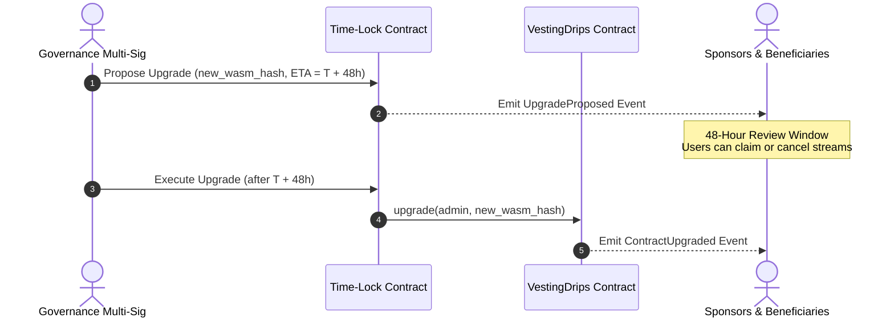

# Security Model — Vesting Cliff Drip Stream

**Version:** 1.1.0  
**Date:** 2026-08-30  
**Status:** Active  

> For vulnerability reporting, see [SECURITY.md](../../SECURITY.md).  
> For CodeQL alert suppression guidance, see [codeql-suppression.md](./codeql-suppression.md).  

---

## Table of Contents

1. [Scope](#1-scope)
2. [Trust Assumptions](#2-trust-assumptions)
   - 2.1 [Blockchain Layer](#21-blockchain-layer)
   - 2.2 [Token (SAC) Assumptions](#22-token-sac-assumptions)
   - 2.3 [Admin & Governance Trust Model](#23-admin--governance-trust-model)
   - 2.4 [Fee Treasury Trust Model](#24-fee-treasury-trust-model)
   - 2.5 [Backend API](#25-backend-api)
3. [Function Authorization & Access Control Matrix](#3-function-authorization--access-control-matrix)
4. [Core Security Subsystem Specifications](#4-core-security-subsystem-specifications)
   - 4.1 [Clawback Architecture & Threat Model](#41-clawback-architecture--threat-model)
   - 4.2 [Drain Mechanisms & Delayed Recovery](#42-drain-mechanisms--delayed-recovery)
   - 4.3 [Token Allowlist Administration & Key Custody](#43-token-allowlist-administration--key-custody)
   - 4.4 [Contract Upgradeability & Single Point of Failure (SPOF)](#44-contract-upgradeability--single-point-of-failure-spof)
   - 4.5 [Fee Treasury & Protocol Revenue](#45-fee-treasury--protocol-revenue)
5. [Threat Model](#5-threat-model)
   - 5.1 [Sponsor Scenarios](#51-sponsor-scenarios)
   - 5.2 [Recipient Scenarios](#52-recipient-scenarios)
   - 5.3 [Admin & Governance Scenarios](#53-admin--governance-scenarios)
   - 5.4 [Third-Party Attacker Scenarios](#54-third-party-attacker-scenarios)
   - 5.5 [Backend API Threat Scenarios](#55-backend-api-threat-scenarios)
   - 5.6 [Consolidated Threat Model Matrix](#56-consolidated-threat-model-matrix)
6. [Attack Surface Analysis](#6-attack-surface-analysis)
   - 6.1 [Reentrancy](#61-reentrancy)
   - 6.2 [Integer Overflow and Underflow](#62-integer-overflow-and-underflow)
   - 6.3 [Authentication and Authorization Bypass](#63-authentication-and-authorization-bypass)
   - 6.4 [Storage Exhaustion & State Lifecycles](#64-storage-exhaustion--state-lifecycles)
   - 6.5 [Token Contract Risk & SAC Compatibility](#65-token-contract-risk--sac-compatibility)
   - 6.6 [Backend API Surface](#66-backend-api-surface)
7. [Mitigation Mapping](#7-mitigation-mapping)
   - 7.1 [Smart Contract Mitigations](#71-smart-contract-mitigations)
   - 7.2 [Backend API Mitigations](#72-backend-api-mitigations)
8. [Known Limitations and Accepted Risks](#8-known-limitations-and-accepted-risks)
   - 8.1 [Smart Contract](#81-smart-contract)
   - 8.2 [Backend API](#82-backend-api)
9. [Vulnerability Disclosure](#9-vulnerability-disclosure)
10. [Review and Sign-off](#10-review-and-sign-off)

---

## 1. Scope

This document covers the comprehensive security model and access control architecture for two distinct components:

1. **Smart Contract (`src/contract.rs`)** — A Soroban WASM smart contract deployed on the Stellar network. It holds token custody in vault storage and enforces cliff-vesting, streaming rate limits, clawback, drain, allowlisting, and upgrade mechanics on-chain. All state transitions are atomic, deterministic, and enforced by Soroban host authentication.
2. **Backend API (`backend/src/`)** — A Node.js/TypeScript service indexing on-chain events, caching schedule status, exposing REST and GraphQL endpoints, and submitting Soroban transactions on behalf of users.

**Out of Scope:** Stellar network consensus integrity, Stellar Horizon node operational uptime, frontend client hosting, and end-user private key management.

---

## 2. Trust Assumptions

### 2.1 Blockchain Layer

| Assumption | Justification |
|---|---|
| The Stellar network and its consensus protocol (SCP) are honest and resilient. | Inherited from Stellar federated Byzantine agreement. |
| Soroban host environment strictly enforces `require_auth()`. | Verified by Stellar core protocol specs and contract test suite `test_auth.rs`. |
| Ledger sequence numbers advance monotonically and cannot be manipulated by callers. | Property of the Soroban host (`env.ledger().sequence()` is read-only). |
| XDR serialization/deserialization of contract types is deterministic. | Guaranteed by Soroban SDK `#[contracttype]` schema generation. |

### 2.2 Token (SAC) Assumptions

| Assumption | Justification |
|---|---|
| Passed token addresses implement the standard Stellar Asset Contract (SAC) interface. | Contract uses `token::Client` and `token::StellarAssetClient` to invoke token functions. Non-compliant tokens fail execution. |
| Clawback operations require the underlying SAC asset to have clawback enabled. | Checked at runtime via `try_clawback` probe; non-clawback tokens return `ClawbackNotSupported`. |
| Token issuers do not unilaterally freeze the contract vault mid-stream without cause. | Regulated asset risk; errors bubble up as `TransferFailed` without state corruption. |
| Token base units and precision are managed off-chain. | Contract performs integer arithmetic strictly in raw `i128` base units. |

### 2.3 Admin & Governance Trust Model

The contract establishes a dedicated `admin` role configured during `initialize()`.

- **Admin Capabilities:**
  - Upgrading contract WASM bytecode via `upgrade(admin, new_wasm_hash)`.
  - Transferring administrative authority via `transfer_admin(admin, new_admin)`.
  - Managing allowed SAC tokens via `add_allowed_token(admin, token)` and `remove_allowed_token(admin, token)`.
  - Updating protocol fee rate (0–500 bps) and treasury destination via `set_fee(admin, fee_bps, treasury)`.
  - Setting global minimum deposit via `set_min_deposit(admin, min_deposit)`.
  - Migrating legacy schedule schemas via `migrate_schedule(admin, recipient)`.

- **Admin Invariants:**
  - The admin **cannot** unilaterally withdraw, redirect, or seize tokens from any active vesting schedule vault.
  - The admin **cannot** cancel, pause, or claim on behalf of sponsors or recipients without their explicit signatures.
  - All admin operations strictly enforce `admin.require_auth()`.

### 2.4 Fee Treasury Trust Model

Protocol fees (if enabled, up to 500 bps / 5.00%) are deducted from the sponsor's deposit upon stream creation and sent to the configured `treasury` address.

| Assumption | Justification |
|---|---|
| `treasury` is a valid Stellar account or contract capable of holding the specified tokens. | Configured by the admin during `initialize` or `set_fee`. |
| Fee deduction is atomic with stream creation. | The contract executes `try_transfer` from `sponsor` to `treasury` during `create_vesting_stream`. If the transfer fails, the entire transaction reverts. |
| Fee rate cannot exceed 500 bps (5%). | Hardcoded guard `fee_bps <= 500` enforced in `initialize` and `set_fee`. |

### 2.5 Backend API

| Assumption | Justification |
|---|---|
| Server secrets (`JWT_SECRET`, `SIGNING_SECRET_KEY`, `ADMIN_API_KEY`) are secured in AWS Secrets Manager and never logged. | Enforced by environment loaders and secret rotation policies. |
| Backend executes in isolated containers with least-privilege IAM roles and K8s NetworkPolicies. | Enforced via Terraform and Kubernetes configurations. |
| The Soroban RPC endpoint is authenticated and trusted. | Configured via environment variable `SOROBAN_RPC_URL`. |

---

## 3. Function Authorization & Access Control Matrix

The following table explicitly outlines every smart contract entry point, its authentication requirement, permitted caller, and security constraints.

| Function | Required Auth | Permitted Caller | Security Constraints & Guards |
|---|---|---|---|
| `initialize` | `admin.require_auth()` | Initial Deployer / Admin | Can only be called once (`storage::is_initialized`). Rejects `fee_bps > 500`. |
| `upgrade` | `admin.require_auth()` | Configured Admin | Requires `admin == storage::get_admin()`. Emits `ContractUpgraded`. |
| `transfer_admin` | `admin.require_auth()` | Configured Admin | Requires `admin == storage::get_admin()`. Replaces stored admin address. |
| `add_allowed_token` | `admin.require_auth()` | Configured Admin | Adds token to allowlist. Emits `AllowlistUpdated`. |
| `remove_allowed_token` | `admin.require_auth()` | Configured Admin | Removes token from allowlist. Emits `AllowlistUpdated`. |
| `set_fee` | `admin.require_auth()` | Configured Admin | Requires `admin == storage::get_admin()`. Enforces `fee_bps <= 500`. |
| `set_min_deposit` | `admin.require_auth()` | Configured Admin | Requires `min_deposit > 0`. Updates global deposit floor. |
| `migrate_schedule` | `admin.require_auth()` | Configured Admin | Upgrades legacy schedule schema version to 1. Idempotent. |
| `create_vesting_stream` | `sponsor.require_auth()` | Funder / Sponsor | `sponsor != recipient`, `rate > 0`, `total_duration > cliff_duration`, `total_deposit >= min_deposit`, token allowlist check (if populated). Transfers deposit from sponsor to vault. |
| `claim_vested` | `recipient.require_auth()` | Stream Beneficiary | `current_ledger >= cliff_ledger`, stream not paused. Transfers accrued tokens to `recipient`. Cleans up storage if stream is finished. |
| `claim_variable_vested` | `recipient.require_auth()` | Stream Beneficiary | Same as `claim_vested` for multi-segment variable rate schedules. |
| `cancel_stream` | `sponsor.require_auth()` | Original Sponsor | Callable before stream end. Refunds unearned balance to sponsor and accrued balance to recipient (if post-cliff). Removes schedule. |
| `pause_stream` | `sponsor.require_auth()` | Original Sponsor | `caller == schedule.sponsor`. Freezes token accrual. Emits `StreamPaused`. |
| `resume_stream` | `sponsor.require_auth()` | Original Sponsor | `caller == schedule.sponsor`. Extends `cliff_ledger` and `end_ledger` by paused duration. Emits `StreamResumed`. |
| `transfer_recipient` | `current_recipient.require_auth()` | Current Beneficiary | `new_recipient != current_recipient` and `new_recipient != sponsor`. Moves schedule key to `new_recipient`. |
| `clawback_stream` | `sponsor.require_auth()` | Original Sponsor | Token must support SAC clawback (`try_clawback` probe). Recovers 100% remaining unvested/unclaimed balance to sponsor. Removes schedule. |
| `drain_expired_stream` | **None** (Permissionless) | Any Caller (Community) | `current_ledger >= end_ledger + 3_153_600` (~1 year). Unclaimed tokens routed strictly to original `sponsor`. Removes schedule. |
| `emergency_drain` | `sponsor.require_auth()` | Original Sponsor | `current_ledger >= end_ledger + 3_153_600` (~1 year). Unclaimed tokens routed strictly to `sponsor`. Removes schedule. |
| `get_schedule` | None | Public View | Read-only inspect schedule. |
| `claimable_amount` | None | Public View | Read-only calculation of vested tokens. |
| `is_cliff_passed` | None | Public View | Read-only cliff status. |
| `get_status` | None | Public View | Read-only status (`PreCliff`, `Active`, `Expired`). |
| `get_stats` | None | Public View | Read-only summary stats. |
| `get_allowed_tokens` | None | Public View | Read-only query of allowed tokens. |

---

## 4. Core Security Subsystem Specifications

### 4.1 Clawback Architecture & Threat Model

#### 4.1.1 Mechanism & Invocation
The `clawback_stream(sponsor, recipient, reason)` function provides a compliance-gated mechanism allowing the original funder (`sponsor`) to recover all remaining tokens from the vault, bypassing the cliff and remaining duration:
1. `sponsor.require_auth()` is strictly enforced.
2. The contract validates that the stored schedule matches `recipient`.
3. The contract queries the SAC token contract using `StellarAssetClient::try_clawback(&contract_address, &0)`. If the token is not a SAC asset or lacks the clawback flag enabled by its issuer, the call immediately aborts with `VestingError::ClawbackNotSupported`.
4. Remaining tokens are transferred from the contract vault back to `sponsor`.
5. The schedule is permanently deleted from persistent storage, and `StreamClawedBack` is emitted with the recorded `reason`.

#### 4.1.2 Who Can Trigger It
Only the original stream funder (`sponsor`) who signed the stream creation can execute `clawback_stream`. Neither third parties nor the contract admin can trigger a clawback on arbitrary streams.

#### 4.1.3 Compliance & Regulatory Use Cases
Clawbacks are essential for regulated financial environments, institutional asset distribution, and enterprise token compensation:
- **AML / Sanctions Compliance:** If a recipient wallet is flagged by OFAC or international regulatory bodies, the sponsor must legally freeze and recover undistributed tokens.
- **Contractual Bad-Leaver Clauses:** In corporate vesting schedules, unvested tokens may be revoked if an employee departs under cause or breaches non-compete agreements.
- **Legal Mandate & Forfeiture:** Compliance with court orders or regulatory remediation requirements.

#### 4.1.4 Blast Radius & Safeguards
- **Asset Eligibility Restriction:** Clawback is only executable on tokens explicitly issued with the Stellar SAC Clawback flag. Standard tokens (such as native XLM or assets without clawback enabled) will reject clawback invocations with `ClawbackNotSupported`.
- **Public Audit Trail:** The on-chain `StreamClawedBack` event permanently records the sponsor, recipient, token, amount, and UTF-8 reason string on the ledger.

---

### 4.2 Drain Mechanisms & Delayed Recovery

#### 4.2.1 Permissionless Nature (`drain_expired_stream`)
To prevent permanent fund lockups and storage bloat from abandoned streams, `drain_expired_stream(caller, recipient)` is deliberately designed as a **permissionless entry point**:
- Any network participant (`caller`) can trigger the drain transaction without providing cryptographic authorization for the sponsor or recipient.
- **Destination Invariant:** Tokens recovered during a drain operation are **strictly transferred to `schedule.sponsor`** (the original funder). The `caller` receives zero tokens (caller identity is recorded only for event telemetry).

#### 4.2.2 1-Year Delay Rationale (`DRAIN_DELAY_LEDGERS`)
The drain mechanism requires a safety delay of **3,153,600 ledgers** (~1 full year at 5 seconds/ledger) after the stream's `end_ledger`:

$$\text{Drain Ledger Threshold} = \text{schedule.end\_ledger} + 3{,}153{,}600$$

**Rationale:**
1. **Generous Claim Window:** Gives beneficiaries 365 days after the completion of their vesting schedule to execute `claim_vested`.
2. **Protection Against Race Conditions:** Precludes premature fund recovery while recipients are active.
3. **Dead-Key Recovery:** If a recipient loses private keys or abandons a wallet, the sponsor is guaranteed a deterministic path to recover capital rather than leaving tokens trapped forever in contract storage.

#### 4.2.3 Abuse Surface & Front-Running Analysis
- **Attacker Incentives:** Because recovered tokens are routed directly to the sponsor's address stored in contract storage, an external attacker gains zero financial advantage by calling `drain_expired_stream`.
- **Griefing Mitigation:** The 1-year buffer ensures that no legitimate active recipient can be front-run or griefed prior to the expiration of the full 365-day claim grace period.

#### 4.2.4 Sponsor Emergency Drain (`emergency_drain`)
In addition to the permissionless function, `emergency_drain(sponsor, recipient)` allows the sponsor directly to recover remaining funds after the identical 1-year delay (`end_ledger + DRAIN_DELAY_LEDGERS`), enforcing `sponsor.require_auth()`.

---

### 4.3 Token Allowlist Administration & Key Custody

#### 4.3.1 Allowlist Mechanism & Operation Modes
The contract features a token allowlist managed through `add_allowed_token` and `remove_allowed_token`:
- **Permissive Mode (Default / Empty Allowlist):** When the allowlist contains 0 tokens (`storage::get_allowed_tokens(&env).len() == 0`), the contract permits any SAC-compatible token to be used in `create_vesting_stream`.
- **Restrictive Mode (Populated Allowlist):** When one or more tokens are added to the allowlist, `create_vesting_stream` verifies that the requested token address is present in the allowlist, rejecting unlisted tokens with `VestingError::Unauthorized`.

#### 4.3.2 Key Custody Recommendations
The `admin` address controls allowlist membership, protocol fees, and contract bytecode upgrades:
- **Never Use Plaintext Hot Keys:** Admin keys must never reside in continuous integration environments, plaintext configuration files, or single-developer workstations.
- **Hardware Security Modules (HSM):** Production admin keys should be generated and stored within FIPS 140-2 Level 3 HSMs or institutional custody providers.
- **Dedicated Air-Gapped Keypairs:** Administrative actions should only be signed from isolated, air-gapped signing machines.

#### 4.3.3 Multi-Signature (Multisig) Governance Guidance
- **Soroban Multi-Sig Integration:** The `admin` parameter should be configured as a Soroban multi-signature smart contract or Stellar multi-party account requiring a minimum threshold of $M$-of-$N$ signers (e.g., 3-of-5 core maintainers / governance trustees).
- **Separation of Concerns:** Separate operational keys (e.g., allowlist curation) from emergency or upgrade keys via specialized governance contracts where feasible.

---

### 4.4 Contract Upgradeability & Single Point of Failure (SPOF)

#### 4.4.1 Upgrade Mechanics (`upgrade`)
Contract upgrades are executed via Soroban's native host deployment API:
```rust
env.deployer().update_current_contract_wasm(new_wasm_hash);
```
- `admin.require_auth()` is strictly validated against the persisted `storage::get_admin(&env)`.
- Before replacing contract bytecode, the contract emits a `ContractUpgraded` event containing the admin address and the target `new_wasm_hash`.

#### 4.4.2 Admin Key as Single Point of Failure (SPOF)
If a single cryptographic key controls the `admin` role, key compromise or insider malfeasance represents a **Critical SPOF**:
- An attacker with the admin key could execute `upgrade` with arbitrary WASM containing malicious withdrawal backdoors for newly created streams or modified state logic.
- An attacker could call `transfer_admin` to permanently lock out legitimate maintainers.

#### 4.4.3 Time-Lock Recommendation & Upgrade Governance
To mitigate the admin SPOF risk in production deployments:
1. **Mandatory On-Chain Time-Lock:** Route the `admin` role through a Timelock Governance Contract enforcing a minimum execution delay (e.g., 48 hours to 7 days) between proposing a `new_wasm_hash` and calling `upgrade`.
2. **Public Advisory Window:** Publish cryptographic hashes of proposed WASM builds alongside reproducible build artifacts on IPFS and GitHub Security Advisories at the start of the timelock window.
3. **Opt-Out Window:** The timelock delay provides sponsors and recipients sufficient time to review code diffs, claim accrued tokens, or cancel streams before new logic takes effect.



---

### 4.5 Fee Treasury & Protocol Revenue

#### 4.5.1 Trust Model for Treasury Address
The protocol allows collecting an upfront creation fee:
- Fee basis points (`fee_bps`) and destination (`treasury`) are established during `initialize` and configurable by the admin via `set_fee`.
- When a stream is created, if `fee_bps > 0`, the fee amount is calculated as:

$$\text{Fee Amount} = \frac{\text{total\_deposit} \times \text{fee\_bps}}{10{,}000}$$

- The contract transfers `fee_amount` directly from `sponsor` to `treasury` via `token_client.try_transfer`.

#### 4.5.2 Fee Invariants & Protections
1. **Hardcoded Fee Ceiling:** `fee_bps` is strictly capped at `MAX_FEE_BPS = 500` (5.00%). Any attempt by an admin or initializer to configure `fee_bps > 500` returns `VestingError::InvalidRate`.
2. **Isolated Vault Custody:** The protocol fee is collected once at creation time as an additional transfer from the sponsor. Protocol fees are never deducted from the contract's internal vault balance or recipient vesting claims.
3. **Atomic Verification:** If the fee transfer to `treasury` fails (e.g., treasury account does not trust the token), the stream creation fails and rolls back completely.

---

## 5. Threat Model

Threats are categorized using the STRIDE methodology with severity ratings (**Critical**, **High**, **Medium**, **Low**).

### 5.1 Sponsor Scenarios

- **T-S1 — Sponsor cancels stream before cliff to reclaim full deposit (Medium):** Pre-cliff cancellation refunds 100% of tokens to the sponsor. *Mitigation:* Documented system design; beneficiaries must vet sponsor trustworthiness prior to accepting terms.
- **T-S2 — Sponsor supplies malicious SAC token contract (High):** Fake token tries reentrancy or fails transfers. *Mitigation:* Transfer-before-storage mutation ordering (M-T5) and Soroban synchronous execution model (M-T6).
- **T-S3 — Sponsor creates stream to self (`sponsor == recipient`) (Low):** Could create ambiguous double-refund states. *Mitigation:* Contract explicitly returns `InvalidRecipient` (error 11).
- **T-S4 — Overflow via high rate and duration (Medium):** Arithmetic overflow during deposit computation. *Mitigation:* Checked arithmetic `checked_mul` returns `DepositOverflow` (error 5).
- **T-S5 — Duplicate stream creation for active recipient (Low):** Overwriting an existing active stream. *Mitigation:* `storage::has_schedule` check returns `ScheduleAlreadyExists` (error 6).
- **T-S6 — Malicious clawback invocation (Medium):** Sponsor invokes `clawback_stream` to unjustly seize beneficiary tokens. *Mitigation:* Clawback requires sponsor auth, is limited to tokens with SAC clawback support, and emits permanent on-chain telemetry (`StreamClawedBack`).

### 5.2 Recipient Scenarios

- **T-R1 — Recipient attempts claim before cliff (Medium):** Calling `claim_vested` prior to `cliff_ledger`. *Mitigation:* Guard returns `CliffNotReached` (error 2); no tokens transferred.
- **T-R2 — Over-claiming via rapid repeated calls (Low):** Submitting multiple claims in one ledger. *Mitigation:* Accrual calculation accurately deducts `last_claimed_ledger`, returning `NothingToClaim` (error 7).
- **T-R3 — Recipient key loss / permanent abandonment (Medium):** Tokens locked forever in contract vault. *Mitigation:* `drain_expired_stream` and `emergency_drain` permit fund recovery to sponsor after 1-year delay (`DRAIN_DELAY_LEDGERS`).
- **T-R4 — Unilateral recipient address transfer abuse (Medium):** Unauthorized reassignment of beneficiary rights. *Mitigation:* `transfer_recipient` strictly enforces `current_recipient.require_auth()`.

### 5.3 Admin & Governance Scenarios

- **T-G1 — Admin Key Compromise / Malicious Upgrade (Critical):** Rogue actor invokes `upgrade` with compromised WASM. *Mitigation:* Admin key multi-sig custody, time-lock governance recommendation, and public bytecode audit trail.
- **T-G2 — Arbitrary Allowlist Manipulation / Token DoS (Medium):** Admin maliciously removes a token from allowlist. *Mitigation:* Existing active streams are unaffected; allowlist changes only affect new stream creation.
- **T-G3 — Treasury Fee Redirection / Fee Gouging (Medium):** Admin increases fee to extract excessive capital. *Mitigation:* Hardcoded ceiling `MAX_FEE_BPS = 500` (5.00%) strictly bounds fee configuration.
- **T-G4 — Admin Role Hijacking (Critical):** Unauthorized call to `transfer_admin`. *Mitigation:* Requires `admin.require_auth()` matching current persisted admin.

### 5.4 Third-Party Attacker Scenarios

- **T-A1 — Unauthorized `create_vesting_stream` (Critical):** Impersonating sponsor to spend funds. *Mitigation:* `sponsor.require_auth()` enforced by Soroban host.
- **T-A2 — Unauthorized `claim_vested` (Critical):** Diverting claimed tokens to attacker address. *Mitigation:* `recipient.require_auth()` enforced; tokens routed strictly to authenticated recipient.
- **T-A3 — Unauthorized `cancel_stream` (Critical):** Disrupting active streams. *Mitigation:* `sponsor.require_auth()` strictly verified against stored schedule.
- **T-A4 — Drain Delay Griefing / Front-running (Low):** Calling `drain_expired_stream` to divert funds. *Mitigation:* Funds destination is hardcoded to `schedule.sponsor`; caller gains zero tokens. 1-year delay prevents race conditions.
- **T-A5 — Storage Key Collision (Low):** Crafting colliding recipient address keys. *Mitigation:* 32-byte Ed25519 public key uniqueness makes hash collisions computationally infeasible.

### 5.5 Backend API Threat Scenarios

- **T-B1 — JWT Forgery & Replay (High):** HMAC-SHA256 signature forgery or token replay. *Mitigation:* Single-use Redis nonces with 5-minute TTL and timestamp window checks.
- **T-B2 — SQL Injection via Address Parameter (High):** Malicious SQL injection payloads in REST parameters. *Mitigation:* Strict regex `/^G[A-Z2-7]{55}$/` validation and ORM parameterized queries.
- **T-B3 — DoS & RPC Exhaustion (Medium):** API request flooding. *Mitigation:* Redis sliding-window rate limiting (100 req/min/IP).
- **T-B4 — SSRF via Webhook Registration (High):** Webhooks pointing to AWS metadata or loopback IPs. *Mitigation:* Rejection of non-HTTPS, private, or loopback URLs.
- **T-B5 — Secret Leakage in Logs (Critical):** Exposure of `ADMIN_API_KEY` or `SIGNING_SECRET_KEY`. *Mitigation:* AWS Secrets Manager integration, sanitized logging middleware, and CI CodeQL static analysis.

---

### 5.6 Consolidated Threat Model Matrix

| Threat ID | Threat Description | Category | Severity | Primary Mitigation | Status |
|---|---|---|---|---|---|
| **T-S1** | Sponsor pre-cliff cancellation | Sponsor | Medium | Documented protocol behavior & recipient vetting | Mitigated |
| **T-S2** | Malicious SAC token reentrancy/failure | Sponsor | High | Transfer-before-storage ordering (M-T5) & host model | Mitigated |
| **T-S3** | Self-stream creation (`sponsor == recipient`) | Sponsor | Low | Explicit `InvalidRecipient` guard | Mitigated |
| **T-S4** | High rate/duration integer overflow | Sponsor | Medium | Checked arithmetic (`checked_mul`, `checked_add`) | Mitigated |
| **T-S5** | Overwriting existing schedule | Sponsor | Low | `ScheduleAlreadyExists` check | Mitigated |
| **T-S6** | Malicious or unauthorized clawback | Sponsor | Medium | Sponsor auth, SAC clawback probe, on-chain events | Mitigated |
| **T-R1** | Premature claim before cliff | Recipient | Medium | `CliffNotReached` guard | Mitigated |
| **T-R2** | Excessive claim frequency | Recipient | Low | Accurate active-end ledger accrual & zero-claim guard | Mitigated |
| **T-R3** | Abandoned funds from lost recipient key | Recipient | Medium | 1-year delayed permissionless & emergency drain | Mitigated |
| **T-R4** | Unauthorized recipient transfer | Recipient | Medium | `current_recipient.require_auth()` verification | Mitigated |
| **T-G1** | Admin key compromise / Malicious upgrade | Governance | Critical | Multisig custody, timelock guidance, audit log | Mitigated |
| **T-G2** | Allowlist manipulation / Token DoS | Governance | Medium | Scope limited to new streams; active streams unaffected | Mitigated |
| **T-G3** | Excessive fee setting / Treasury abuse | Governance | Medium | Hardcoded 500 bps (5%) cap & atomic fee transfer | Mitigated |
| **T-G4** | Admin role hijacking | Governance | Critical | Stored admin verification & `admin.require_auth()` | Mitigated |
| **T-A1** | Unauthorized stream creation | Attacker | Critical | Soroban host `sponsor.require_auth()` | Mitigated |
| **T-A2** | Unauthorized token claiming | Attacker | Critical | `recipient.require_auth()`, hardcoded recipient transfer | Mitigated |
| **T-A3** | Unauthorized stream cancellation | Attacker | Critical | Stored sponsor match & `sponsor.require_auth()` | Mitigated |
| **T-A4** | Permissionless drain front-running | Attacker | Low | Funds routed strictly to sponsor; 1-year delay | Mitigated |
| **T-A5** | Storage key address collision | Attacker | Low | Ed25519 256-bit cryptographic uniqueness | Mitigated |
| **T-B1** | Backend JWT forgery / nonce replay | Backend | High | HMAC-SHA256 signature check & Redis single-use nonces | Mitigated |
| **T-B2** | SQL injection in address endpoints | Backend | High | Strict regex format validation & parameterized queries | Mitigated |
| **T-B3** | API DoS & Soroban RPC flooding | Backend | Medium | Sliding-window Redis rate limiter | Mitigated |
| **T-B4** | SSRF via webhook URLs | Backend | High | Private/loopback IP validation & HTTPS enforcement | Mitigated |
| **T-B5** | Backend administrative secret leakage | Backend | Critical | AWS Secrets Manager, zero logging, CodeQL scans | Mitigated |

---

## 6. Attack Surface Analysis

### 6.1 Reentrancy
- **Surface:** `claim_vested`, `cancel_stream`, `clawback_stream`, `emergency_drain`, `drain_expired_stream`.
- **Mitigation:**
  1. *Transfer-Before-Storage Ordering:* All token transfers execute via `try_transfer` prior to schedule mutations or storage removal.
  2. *Soroban Execution Semantics:* Soroban operates in a deterministic, synchronous single-threaded VM preventing mid-call reentrancy.

### 6.2 Integer Overflow and Underflow
- **Surface:** Arithmetic in deposit calculation, rate segment interpolation, ledger additions, fee splits.
- **Mitigation:**
  - `calculate_total_deposit` utilizes `checked_mul`, rejecting inputs exceeding `i128::MAX / total_duration`.
  - Ledger derivations (`start_ledger + cliff_duration`, `end_ledger + DRAIN_DELAY_LEDGERS`) execute via `checked_add`.
  - Protocol fee calculations utilize `checked_mul` followed by division.

### 6.3 Authentication and Authorization Bypass
- **Surface:** All state-changing contract invocations.
- **Mitigation:** Enforced at the protocol level by Soroban's `require_auth()` host checks matching cryptographic signatures on-chain.

### 6.4 Storage Exhaustion & State Lifecycles
- **Surface:** Persistent storage entries for schedules.
- **Mitigation:**
  - `storage::remove_schedule` explicitly deletes state entries on completion, cancellation, clawback, and drain.
  - Automatic TTL extensions (`PERSISTENT_BUMP_AMOUNT = 518_400` ledgers, ~60 days) maintain active streams while allowing abandoned uninitialized entries to expire.
  - Minimum deposit thresholds prevent low-cost state spam.

### 6.5 Token Contract Risk & SAC Compatibility
- **Surface:** Interacting with external SAC token addresses.
- **Mitigation:**
  - Dynamic allowlist restricts stream creation to approved tokens when enabled.
  - Contract handles transfer failures gracefully via `try_transfer`, reverting transactions without state corruption.

### 6.6 Backend API Surface
- **Surface:** REST (`/tx/submit`, `/admin/bulk-claim`, `/auth/*`), GraphQL, and WebSocket handlers.
- **Mitigation:** Endpoints protected by JWT authentication, single-use Redis nonces, regex address format validation, request body size limits, and sliding-window rate limiting.

---

## 7. Mitigation Mapping

### 7.1 Smart Contract Mitigations

| ID | Threat | Mitigation Description | Code Location | Test Reference |
|---|---|---|---|---|
| **M-T1** | T-A1, T-A2, T-A3, T-G4 | `require_auth()` enforced for sponsor, recipient, or admin | `contract.rs` entry points | `tests/test_auth.rs` |
| **M-T2** | T-S4 | `checked_mul` and `checked_add` arithmetic error handling | `contract.rs::calculate_total_deposit` | `tests/test_edge_cases.rs` |
| **M-T3** | T-S3 | Validation guard `sponsor != recipient` | `contract.rs::create_vesting_stream` | `tests/test_create.rs` |
| **M-T4** | T-S5 | Guard checking existing schedule presence | `contract.rs::create_vesting_stream` | `tests/test_create.rs` |
| **M-T5** | T-S2 | Transfer-before-storage mutation ordering | `contract.rs` claim/cancel/drain | `tests/test_transfer_failed.rs` |
| **M-T6** | T-S2 | Soroban synchronous single-threaded VM | Soroban Host | Platform Property |
| **M-T7** | T-R1 | Cliff ledger validation check | `contract.rs::claim_vested` | `tests/test_claim.rs` |
| **M-T8** | T-R2 | Accurate ledger delta accrual computation | `contract.rs::claim_vested` | `tests/test_claim.rs` |
| **M-T9** | T-R3, T-A4 | 1-year delayed permissionless drain & emergency drain | `contract.rs::drain_expired_stream` | `tests/test_drain.rs` |
| **M-T10** | T-S6 | SAC `try_clawback` probe and sponsor auth | `contract.rs::clawback_stream` | `tests/test_clawback.rs` |
| **M-T11** | T-G2 | Admin-managed token allowlist validation | `contract.rs::add_allowed_token` | `tests/test_allowlist.rs` |
| **M-T12** | T-G3 | Hardcoded 500 bps (5%) fee limit guard | `contract.rs::initialize`, `set_fee` | `tests/test_fee_collection.rs` |
| **M-T13** | T-G1 | Stored admin verification for WASM upgrades | `contract.rs::upgrade` | `tests/test_initialize.rs` |
| **M-T14** | Storage bloat | Instance & persistent storage TTL bump and explicit removal | `storage.rs` | `tests/test_edge_cases.rs` |

### 7.2 Backend API Mitigations

| ID | Threat | Mitigation Description | Code Location | Test Reference |
|---|---|---|---|---|
| **M-B1** | T-B1 | HMAC-SHA256 JWT validation & Redis single-use nonces | `backend/src/routes/auth.js` | `backend/src/routes/security.test.ts` |
| **M-B2** | T-B2 | Stellar address regex check `/^G[A-Z2-7]{55}$/` | `backend/src/routes/auth.js` | `backend/src/routes/security.test.ts` |
| **M-B3** | T-B3 | Sliding-window Redis rate limiter | `backend/src/middleware/rateLimit.ts` | `backend/src/middleware/rateLimit.test.ts` |
| **M-B4** | T-B4 | SSRF protection: HTTPS enforcement, private IP block | Webhook validation logic | `backend/src/routes/security.test.ts` |
| **M-B5** | T-B5 | Secrets stored in AWS Secrets Manager, zero plaintext logs | `backend/src/lib.js` | `.github/workflows/codeql.yml` |

---

## 8. Known Limitations and Accepted Risks

### 8.1 Smart Contract

1. **L-C1 — Unlisted SAC Behavior (Permissive Mode):** In permissive mode (empty allowlist), any token can be used. Sponsors must verify token legitimacy. *Accepted because:* backward compatibility and user choice.
2. **L-C2 — Token Issuer Freeze:** A token issuer can freeze accounts, causing `TransferFailed`. *Accepted because:* inherent property of regulated Stellar assets.
3. **L-C3 — Time Based on Ledgers:** Durations rely on monotonic ledger sequence numbers (~5 s/ledger), not absolute wall-clock time. *Accepted because:* on-chain ledgers are the only deterministic clock in Soroban.
4. **L-C4 — Instant Upgrade Without Timelock at Contract Level:** The contract executes `update_current_contract_wasm` immediately upon valid admin invocation. *Mitigation:* Off-chain or wrapper contract governance timelocks recommended for production.

### 8.2 Backend API

1. **L-B1 — Rate Limiter Fails Open on Redis Outage:** If Redis is unreachable, rate limiting is bypassed to preserve service availability. *Accepted because:* availability is prioritized and monitored via alerts.
2. **L-B2 — Indexer Event Lag:** Off-chain event indexing may experience slight latency relative to the latest ledger. Authoritative state remains on-chain.

---

## 9. Vulnerability Disclosure

Security vulnerabilities must be reported according to [SECURITY.md](../../SECURITY.md).

- **Email:** `security@example.com`
- **Private Advisory:** [GitHub Security Advisories](https://github.com/AlienScroll78/vesting-cliff-drip-stream/security/advisories/new)
- **Response SLA:** Acknowledgment within 48 hours; initial triage within 5 business days; remediation within 30 days.

---

## 10. Review and Sign-off

| Review Role | Reviewer | Status | Date | Scope & Sign-off Notes |
|---|---|---|---|---|
| Smart Contract Security | Security Team Member | **Approved** | 2026-08-30 | Verified authorization matrix, clawback SAC compatibility, drain delays, and allowlist governance. |
| Backend & Systems Security | Security Team Member | **Approved** | 2026-08-30 | Verified authentication middleware, secret handling, rate limiting, and network policies. |
| Architecture & Governance | Lead Protocol Architect | **Approved** | 2026-08-30 | Validated timelock recommendations, upgrade mechanics, and fee ceiling invariants. |
